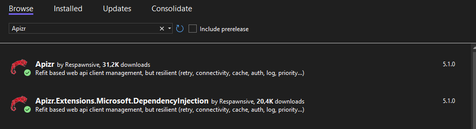

## Getting Started

- [Getting Started](#getting-started)
  - [Apizr Introduction](#apizr-introduction)
  - [Understand \& Clean Monkeyfinder](#understand--clean-monkeyfinder)
    - [Open Solution in Visual Studio](#open-solution-in-visual-studio)
    - [Build, run and debug the app](#build-run-and-debug-the-app)
    - [Analysis of the current API implementation, usage and limits](#analysis-of-the-current-api-implementation-usage-and-limits)
    - [Using the MonkeyService](#using-the-monkeyservice)
    - [Clean and "correct" the current sample](#clean-and-correct-the-current-sample)
  - [Add Apizr to MonkeyFinder](#add-apizr-to-monkeyfinder)
    - [Add Nuget packages](#add-nuget-packages)
    - [Define IMonkeyApi](#define-imonkeyapi)
    - [Inject ApizrManager at startup](#inject-apizrmanager-at-startup)
    - [Use ApizrManager to replace HttpClient](#use-apizrmanager-to-replace-httpclient)
  - [Apizr Resume :](#apizr-resume-)

### Apizr Introduction

Apizr has been created for faciliting the configuration, implementation and usage of "advanced" API client (HttpClient) service/instance, with the best practices, the integration of powerfull and frequently used third parties librairies, new and common patterns in mind (fluent, attributes), and years of experiences (and real implementations) in our customers projects (according to our developers/company choices and point of view, therefore necessarily subjective...)

As mobile applications developpers, we get rid of doing again the same things on each new project, and we create this library to help us to configure quickly and easily all our Api Clients in all our different projects, in the same "standard-way" (or "code-habits"), with the less code/boilerplate as possible, and the more configuration/customization as possible.

In this workshop, we will see the "basics" of Apizr (implementation and uses) but we have lots of extensions and advanced usages around this core library (with separate extension NuGet Packages, to include only what you realy need).

The "advantages" of Apizr will not be obvious in this workshop (because this sample is very to much simple, with just one very simple "GET" endpoint), but in more complex projects with more complex functionnal needs and advanced scenarios, Apizr will better reveal all is potential !

So in this workshop we simply will learn how to add/migrate/use Apizr on an existing project, and extend it step by step to offer some nice and usual basic features.

You can find more updated informations and more complex scenario on the [GitHub repo](https://github.com/Respawnsive/Apizr) or in the documentation :

[](https://apizr.net/ "Go to project documentation")

This project is Open-Source and will have a "minimum viable support" (as our company use it in production on all our customer project).
So feel free to use it, and all your remarks, suggestions and contributions are welcome !

And if you realy like it, please consider to give us a star on GitHub, and/or to support our work on [GitHub Sponsors](https://github.com/sponsors/Respawnsive)

### Understand & Clean Monkeyfinder

#### Open Solution in Visual Studio

1. Open **Part 1 - Getting Started/MonkeyFinder.sln**

This MonkeyFinder contains 1 project:

* MonkeyFinder - The main .NET MAUI project that targets Android, iOS, macOS, and Windows. It includes all scaffolding for the app including Models, Views, ViewModels, and Services.


The **MonkeyFinder** project is the result of the MAUI workshop, and is complete at this point (MauiProgram, Model, Views, ViewModels, and Services) and will be used as a reference for the Hands on Lab.

#### Build, run and debug the app

Try to build and run the app on Android, iOS, macOS, and/or Windows.
If all is ok, you are ready for this workshop and can continue with the next step.
Otherwise, please check the original MAUI workshop to fix your environment.

#### Analysis of the current API implementation, usage and limits

First, as a common and usual good practice, James Montemagno has created a dedicated **MonkeyService** that is injected at startup in the MauiProgram ServicesCollection, as a singleton instance (that will be shared and accessible everywhere in the application) :

```csharp
public static class MauiProgram
{
	public static MauiApp CreateMauiApp()
	{
        [...]

        builder.Services.AddSingleton<MonkeyService>();

        [...]
    }
}
```

First, open this `Services\MonkeyService.cs` file to understand first how it realy works :

```csharp
public class MonkeyService
{
    HttpClient httpClient;
    public MonkeyService()
    {
        this.httpClient = new HttpClient();
    }

    List<Monkey> monkeyList;
    public async Task<List<Monkey>> GetMonkeys()
    {
        if (monkeyList?.Count > 0)
            return monkeyList;

        // Online
        var response = await httpClient.GetAsync("https://www.montemagno.com/monkeys.json");
        if (response.IsSuccessStatusCode)
        {
            monkeyList = await response.Content.ReadFromJsonAsync(MonkeyContext.Default.ListMonkey);
        }

        // Offline
        using var stream = await FileSystem.OpenAppPackageFileAsync("monkeydata.json");
        using var reader = new StreamReader(stream);
        var contents = await reader.ReadToEndAsync();
        monkeyList = JsonSerializer.Deserialize(contents, MonkeyContext.Default.ListMonkey);
        
        return monkeyList;
    }
}
```

In this current code, the service will :
- Create an HttpClient instance at startup (singleton & service constructor) and will keep this HttpClient in memory (in a private declared **httpClient**) :
  ```csharp
  HttpClient httpClient;
  public MonkeyService()
  {
     this.httpClient = new HttpClient();
  }
  ```
  *The problem here is that if we need custom headers, authentication/token, log&trace, mapping... or any potential HttpClient customization or behaviors, we have to do it just after the instantiation of the **new HttpClient();** in this service constructor, and we will not be able to "share" our customized HttpClient with other potential Services that may need to use it too. To resolve this, a common practice is to create (and configure/customize) a single instance of our HttpClient in an "ApiService" and inject this ApiService (that expose our custom HttpClient) in the serviceCollection on app startup. This way, the MonkeyService is not responsible of our API endpoint configuration, and you just have to resolve your custom HttpClient in the MonkeyService constructor to use it (or in any other service/viewModel ctor that may need the same httpClient configuration). The result will be this modification for example :*
  ```csharp
  HttpClient httpClient;
  public MonkeyService(IApiService myApiService)
  {
     this.httpClient = myApiService.httpClient;
  }
  ```
- Expose a single async method **GetMonkeys()** that will be responsible to return the list of monkeys (all the datas) for the entire application : 
  ```csharp
  public async Task<List<Monkey>> GetMonkeys()
  {
    [...]
  }
  ```
    *The "consumers" of this service (the MonkeyViewModel here) don't have to know how and from where the datas are coming, it just "need the datas" by calling this GetMonkeys() from the MonkeyService, who is in charge of the "business rules" to get and return the datas. Here, James Montemagno's "choices" for this workshop can be analyzed like this :*

  - To act as a kind of "minimal cache" (avoiding unnecessary multiple API call) he store the list of monkeys in a private variable (outside of the method) :
    ```csharp
    List<Monkey> monkeyList;
    ```
  - If the list is not null (already loaded previously) and if there is at least one monkey present, he just return the monkey list :
    ```csharp
    if (monkeyList?.Count > 0)
        return monkeyList;
    ```
    *The potential problem here is that the list of monkeys is loaded only once for the entire application lifecycle (on the first call) and after that point, the list of monkeys will never be updated anymore (until the app close/dispose/restart) and even if the monkeys list have been updated on the server side, it will not be updated on the application side...*

  - Then, he call the endpoint API, get the response, and if he got a result with a valid StatusCode, he parse the json response content as a list of Monkeys, and he store this result in the monkeyList variable :
    ```csharp
    // Online
    var response = await httpClient.GetAsync("https://www.montemagno.com/monkeys.json");
    if (response.IsSuccessStatusCode)
    {
        monkeyList = await response.Content.ReadFromJsonAsync(MonkeyContext.Default.ListMonkey);
    }
    ```
    *We can find multiples potential problems here : if httpClient.GetAsync() method got an error during the call (404 not found, TimeOut, 50x, WhatEver...) it may/could throw an exception, and as we dont try/catch this exception here, the entire GetMonkey method will thows an exception too (so it is the "caller", in the MonkeysViewModel, that has to handle the Exception for managing it and not crashing the entire application). The second thing we can say here is that if the response is Ok, we just store the monkeyList in our private variable, but we don't return the monkeyList directly after that... so the next code/instructions will always be executed too !*

  - Finaly, we (re)load the monkeyList by reading and parsing an embedded AppPackageFile "monkeydata.json" :
    ```csharp
    // Offline
    using var stream = await FileSystem.OpenAppPackageFileAsync("monkeydata.json");
    using var reader = new StreamReader(stream);
    var contents = await reader.ReadToEndAsync();
    monkeyList = JsonSerializer.Deserialize(contents, MonkeyContext.Default.ListMonkey);
    ```
    *As we mention in the point just before, even if we are online and with a previous correct API result, this is always executed and it override/replace the list of monkeys. Moreover, as we don't check the "connection status" here (but in the MonkeysViewModel, we'll see it later), we don't know if we are online or offline (and this code is always executed, so the API call is useless for real ;-)*

##### Using the MonkeyService

Finaly, this MonkeyService is used only once in the entire application, in the **MonkeyViewModel.cs** file.

To be accessible in this viewModel, we resolve the existing single instance of the MonkeyService in the VM constructor (thanks to the startup DI/ServiceCollection) and we store it as a private (idealy readonly) instance of the MonkeyService :

```csharp
MonkeyService monkeyService;
IConnectivity connectivity;
IGeolocation geolocation;
public MonkeysViewModel(MonkeyService monkeyService, IConnectivity connectivity, IGeolocation geolocation)
{
    Title = "Monkey Finder";
    this.monkeyService = monkeyService;
    this.connectivity = connectivity;
    this.geolocation = geolocation;
}
```

 The final call is triggered in the **GetMonkeysAsync()** Command :
```csharp
[RelayCommand]
    async Task GetMonkeysAsync()
    {
        if (IsBusy)
            return;

        try
        {
            if (connectivity.NetworkAccess != NetworkAccess.Internet)
            {
                await Shell.Current.DisplayAlert("No connectivity!",
                    $"Please check internet and try again.", "OK");
                return;
            }

            IsBusy = true;
            var monkeys = await monkeyService.GetMonkeys();

            if(Monkeys.Count != 0)
                Monkeys.Clear();

            foreach(var monkey in monkeys)
                Monkeys.Add(monkey);

        }
        catch (Exception ex)
        {
            Debug.WriteLine($"Unable to get monkeys: {ex.Message}");
            await Shell.Current.DisplayAlert("Error!", ex.Message, "OK");
        }
        finally
        {
            IsBusy = false;
            IsRefreshing = false;
        }

    }
```
*Note the check of connectivity here, it show an error dialog and return directly without loading any monkey (even if the monkeyService.GetMonkey() can manage offline itself and will return embedded datas). Moreover, you can notice the try/catch block to manage the GetMonkey() potential exceptions.*

James is really not a beginner developer and it was my hero for years since I begin to use Xamarin, more than 10 years ago... he teach me so much during years with his videos/workshops/samples.

So why there is so much "potential errors" in this implementation ? 

Keep in mind that the main goal of Jame's MAUI workshop is to show you how to create quickly and quite exhaustively an entire MAUI application with a list page, a detail page, a map page, the navigation and the main MAUI concepts... with a quite clean application architecture and some good practices (MVVM/Services/DI/...) and that is "working" in just some few time and with very few code, on different platforms (Android/iOS/Windows/Mac...)... a workshop is not a production app, it's just for helping you to "understand the concepts" by a rapid implementation and experimentation by yourself.

The second reason is that having a "well structured", losely coupled, configurable, robust and resilient API client (like it is often needed in bigger real production apps), and having a such ApiClient can be very verbose and very complex if you make it on your own from scratch with a basic "HttpClient"... and this is not the main goal of Jame's workshop, it would be less comprehensive and it risk to loose your brain in the lumbs of HttpClient and API client implementation...

But what if we could easily implement a better API client/practices/architecture, without being more verbose (in fact, the code will even be smaller) or being too much complex, and get start since the beginning of a project with a better and more evolutive client API architecture (like in "real world production" app) ?

This is the goal of Apizr, and in this Workshop we will show you how to implement the same functionnalities and result as before, and extend it step by step.
   

#### Clean and "correct" the current sample

At Respawnsive we are "Monk" developers (from the old TV show reference... not from the animal) and we want to create clean code from a clean basis... even for a quick workshop, we can't leave errors (that we know they exists) in our codes, and we are forced to apply our (good?) habits of coding... it's stronger than us, it's viceral !

So the first step is to "correct" the code from our point of view.

Get back to the `Services\MonkeyService.cs` file and we will :

- Resolve (and use) the IConnectivity instance directly in the service (and not in the viewModel anymore)
- Correct/Manage the "online/offline" cases directly in the GetMonkeys() method (and not in the viewModel anymore) and with HttpClient Exceptions  or bad StatusCode
- Add explicitly the "private readonly" declaration for local variables, start their naming with an underscore and do not use "this." anymore (our choices of good practices/habits/guidelines)
- Create a separate private "GetLocalMonkeys()" for best readability and online/offline uses/calls
- Create an interface "IMonkeyService" to define (Inherit from), strongly type, and structure the MonkeyService (we could provide/inject another MonkeyService implementation for unit test in example...)

```csharp
public class MonkeyService
{
    private readonly HttpClient _httpClient;
    private readonly IConnectivity _connectivity;

    public MonkeyService(IConnectivity connectivity) : IMonkeyService
    {
        _httpClient = new HttpClient();
        _connectivity = connectivity;
    }

    private List<Monkey> _currentMonkeys;
    public async Task<List<Monkey>> GetMonkeys()
    {
        if (_currentMonkeys?.Count > 0)
            return _currentMonkeys;

        if (_connectivity.NetworkAccess != NetworkAccess.Internet)
        {
            // Offline -> we just inform the user (not blocking) and return local monkeys
            await Shell.Current.DisplayAlert("No connectivity!", $"Local monkeys will be loaded.", "OK");
            _currentMonkeys = await GetLocalMonkeys();
        }
        else
        {
            try
            {
                // Online -> Try to call API endpoint
                var response = await _httpClient.GetAsync("https://www.montemagno.com/monkeys.json");
                if (response.IsSuccessStatusCode)
                {
                    //response successful, we get monkeys from API
                    _currentMonkeys = await response.Content.ReadFromJsonAsync(MonkeyContext.Default.ListMonkey);
                }
                else
                {
                    //response not successful, we just inform the user (not blocking) and return local monkeys
                    Debug.WriteLine($"Error : _httpClient.GetAsync() return bad status code : {response?.StatusCode} ({response?.ReasonPhrase})");
                    await Shell.Current.DisplayAlert("Error (StatusCode)!", "Unable to get monkeys Online, local monkeys will be loaded.", "OK");
                    _currentMonkeys = await GetLocalMonkeys();
                }
            }
            catch(Exception ex)
            {
                // Exception, we just inform the user (not blocking) and return local monkeys
                Debug.WriteLine($"Error : _httpClient.GetAsync() throws : {ex?.Message} ({ex?.StackTrace})");
                await Shell.Current.DisplayAlert("Error (HttpClient)!", "Unable to get monkeys Online, local monkeys will be loaded.", "OK");
                _currentMonkeys = await GetLocalMonkeys();
            }
        }
        //Here we are sure to have monkeys, either from memory/last call, from API or from local file
        return _currentMonkeys;
    }

    private async Task<List<Monkey>> GetLocalMonkeys()
    {
        using var stream = await FileSystem.OpenAppPackageFileAsync("monkeydata.json");
        using var reader = new StreamReader(stream);
        var contents = await reader.ReadToEndAsync();
        return JsonSerializer.Deserialize(contents, MonkeyContext.Default.ListMonkey);
    }
}
```

Create the interface IMonkeyService with this code :

```csharp
namespace MonkeyFinder.Services;

public interface IMonkeyService
{
    Task<List<Monkey>> GetMonkeys();
}
```

Modify the startup service injection by registering the service with the interface explicitely :

```csharp
public static class MauiProgram
{
	public static MauiApp CreateMauiApp()
	{
        [...]

        builder.Services.AddSingleton<IMonkeyService, MonkeyService>();

        [...]
    }
}
```
And make the **MonkeyService** class explicitly implementing this IMonkeyService like this : 

```csharp
public class MonkeyService : IMonkeyService
{
    [...]
}
```

Next we can simplify, clean and modify the `ViewModels\MonkeysViewModel.cs` :

```csharp
private readonly IMonkeyService _monkeyService;
private readonly IGeolocation _geolocation;

public MonkeysViewModel(IGeolocation geolocation, IMonkeyService monkeyService)
{
    Title = "Monkey Finder";
    _monkeyService = monkeyService;
    _geolocation = geolocation;
}

[...]

[RelayCommand]
private async Task GetMonkeysAsync()
{
    if (IsBusy)
        return;

    IsBusy = true;
    var monkeys = await _monkeyService.GetMonkeys();

    if (Monkeys.Count != 0)
        Monkeys.Clear();

    foreach(var monkey in monkeys)
        Monkeys.Add(monkey);

    IsBusy = false;
    IsRefreshing = false;

}
```

Build and run this new version, normaly everything will still works.

Ok, we are good to start the Apizr workshop !

### Add Apizr to MonkeyFinder

#### Add Nuget packages

First, open the NuGet Package Manager, search for "Apizr", and install "Apizr" and "Apizr.Extensions.Microsoft.DependencyInjection" (because MAUI is using MS DI for startup registration by default, so we will use it for Apizr too in the same way)



#### Define IMonkeyApi 

Based on Refit (and with help of Apizr overloads), we will define our API endpoint(s) just with an Interface, let's create this "IMonkeyApi" interface, and take a look at it's definition :

```csharp
using Apizr;
using Refit;

namespace MonkeyFinder.Services;

[WebApi("https://www.montemagno.com")]
public interface IMonkeyApi
{
    [Get("/monkeys.json")]
    Task<List<Monkey>> GetMonkeysAsync();
}
```

Here we have defined only 1 endpoint **GetMonkeysAsync()** with an attribut "GET" targeting the last url segment endpoint, and that will return a List<Monkey> in an asynchronous way.
By simply adding an attribute **[WebApi("https://www.montemagno.com")]** at the IMonkeyApi level, we defined that this interface (and all the potentials methods inside) is an Api to be "compiled-time-generated" by Refit/Apizr, with a baseUrl (that will be used as "base path" for every method inside). This way, our Endpoint is already entirely defined and we can now inject and use an ApizrManager for this IMonkeyApi.

#### Inject ApizrManager<IMonkeyApi> at startup

in the **MauiProgram.cs**, add the **using Apizr** and register in the MS DI Services an instance of an ApizrManager<IMonkeyApi> before the previous IMonkeyService (because IMonkeyService will use/need this IApizrManager...) :

```csharp
public static class MauiProgram
{
	public static MauiApp CreateMauiApp()
	{
        [...]
        builder.Services.AddApizrManagerFor<IMonkeyApi>();
        builder.Services.AddSingleton<IMonkeyService, MonkeyService>();

        [...]
    }
}
```

#### Use ApizrManager<IMonkeyApi> to replace HttpClient

To be used in the **MonkeyService.cs**, we have first to resolve the ApizrManager<IMonkeyApi>, we can entirely remove the HttpClient everywhere, and replacing it with the use of ApirzManager call instead :

```csharp
using Apizr;

namespace MonkeyFinder.Services;

public class MonkeyService : IMonkeyService
{
    private readonly IConnectivity _connectivity;
    private readonly IApizrManager<IMonkeyApi> _monkeyApiManager;

    public MonkeyService(IConnectivity connectivity, IApizrManager<IMonkeyApi> monkeyApiManager)
    {
        _connectivity = connectivity;
        _monkeyApiManager = monkeyApiManager;
    }

    private List<Monkey> _currentMonkeys;
    public async Task<List<Monkey>> GetMonkeys()
    {
        if (_currentMonkeys?.Count > 0)
            return _currentMonkeys;

        if (_connectivity.NetworkAccess != NetworkAccess.Internet)
        {
            // Offline -> we just inform the user (not blocking) and return local monkeys
            await Shell.Current.DisplayAlert("No connectivity!", $"Local monkeys will be loaded.", "OK");
            _currentMonkeys = await GetLocalMonkeys();
        }
        else
        {
            try
            {
                // Try to call API endpoint with ApizrManager
                _currentMonkeys = await _monkeyApiManager.ExecuteAsync(api => api.GetMonkeysAsync());
                if (_currentMonkeys?.Count == 0)
                {
                    //response not successful, we just inform the user (not blocking) and return local monkeys
                    await Shell.Current.DisplayAlert("Error (ApizrManager)!", "Unable to get monkeys Online, local monkeys will be loaded.", "OK");
                    _currentMonkeys = await GetLocalMonkeys();
                }
            }
            catch(Exception ex)
            {
                // Exception, we just inform the user (not blocking) and return local monkeys
                Debug.WriteLine($"Error : _monkeyApiManager throws : {ex?.Message} ({ex?.StackTrace})");
                await Shell.Current.DisplayAlert("Error (Exception)!", "Unable to get monkeys Online, local monkeys will be loaded.", "OK");
                _currentMonkeys = await GetLocalMonkeys();
            }
        }
        //Here we are sure to have monkeys, either from memory/last call, from API or from local file
        return _currentMonkeys;
    }

    [...]
}
```

Note the manner to call the endpoint with the ApizrManager : 
- we give to the ApizrManager a "delegate" (async) to indicates witch endpoint to call/execute
- the call will return directly a List<Monkey> (we will see later how the exceptions or statusCode can be handled)
- We just have to count the currentMonkey to verify all is Ok (if not, load from local)

That's it, build and run, all will be working correctly, we finished to "iso-replace" Apizr instead of HttpClient using.

### Apizr Resume :

- Simply define your "client API & Endpoint(s)" with an Interface(Api) containing methods(Endpoints) very quickly with just some attributes.
- Inject an ApizrManager<TApi> in your DI container (with the help of the Apizr.Extensions.Microsoft.DependencyInjection package)
- Use the ApizrManager<TApi> to call your endpoints.


In the next part, we will see how to configure the logging into Apizr :

* [Part 2 - Configure logging](../Part%202%20-%20Configure%20logging/README.md)


